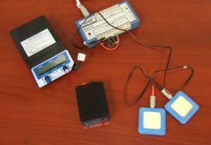
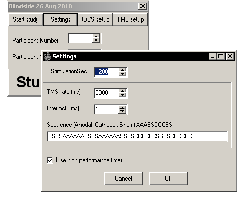

## Blindside 

Blindside is software and hardware that controls the administration of tDCS. It allows experimenters to run double blind studies.
Transcranial direct current stimulation (tDCS) is a technique for modulating brain activity. In this technique, a very small current (~1 mA) is passed between two electrodes (typically, sponges soaked in saline), with at least one placed on the scalp near the cortex. It is believed that tDCS facilitates neural activity under an anodal electrode and inhibits activation under a cathodal electrode. tDCS has many potential benefits. It is very inexpensive, safe (Nitsche 2003a, 2009) and easy to use. In addition, the effects of tDCS appear to be sustained – for example Nitsche et al. (2003b) note that a ten-minute stimulation can influence behavior for a couple hours. This has clear clinical potential (Baker, 2010).

Despite these attractive features, the effect sizes observed with current tDCS paradigms are very small. A major concern is that experimenter demand can drive small effects (e.g. the Clever Hans effect, where a horse appeared to be able to count by watching the movements of his trainer). This means that the experimenter might be accidentally influencing the data. Therefore, it is very important to ensure that tDCS studies use careful double-blind controls. In other words, neither the experimenter nor the participant should be aware of the stimulation provided.

Blindside is a software program that uses the USB port to control a tDCS stimulator. The hardware includes a tDCS stimulator (black with knobs in the photo), a ADU 218 USB device with solid state (silent) relays (blue in the photo), and a circuit tester (the black box with the red and green lights).

For a completely blind study, blindside should use two scientists: the administrator keeps the circuit tester and knows the control code for unlocking the sequence of stimulation and the scientist, who collects the experimental data.

Before running any participants, you should press the ‘Settings’ button to prepare your randomization sequence. The settings panel allows you to select one of three experimental designs:

 - **Two sessions: [++,–]; Sham** – each person visits twice, receiving standard polarity stimulation during one session and sham stimulation on the other.
 - **Two sessions: [++,–]; [+-,-+]** – each person visits twice, receiving standard polarity stimulation during one session and reverse polarity stimulation on the other.
 - **Three sessions: [++,–]; sham; [+-,-+]** – each person visits three times, receiving standard polarity stimulation during one session, reverse polarity stimulation on another and sham stimulation on another.

You will also want to set the time of stimulation, for example if each person is to receive 20 minutes of stimulation you want to specify 1200 sec. If you have a sham session, you will want to set the “sham sec” – this is the amount of time stimulation will be delivered during the sham stimulation (people typically habituate to the scalp tingling in 30-60sec). You can also set a random seed – this will generate a unique pattern of counterbalanced stimulation. Finally, you will want to set the number of participants in your study. This should be selected prior to collecting any data – the number should be evenly divisible by 2 for designs with two sessions (the orders a ab or ba) and divisible by 6 for designs with 3 sessions (abc, acb, bac, bca, cab, cba). It is important that you do not change any of these values when you run a study. If you wanted to collect data from 8 people and later decide to run additional participants, you should create this as an entirely new experiment.

Before launching the blindside application, make sure the ADU 218 is plugged into the USB port. If you forget this, the program will remind you, and you will be forced to restart the program to proceed. The administrator can check that the devices are working properly by plugging the test circuit into the tDCS electrode leads and pressing the test button – when the tDCS is switched on ‘standard polarity’ will illuminate the green light, ‘reversed polarity’ will illuminate the red light, and ‘sham’ will not illuminate any lights but will also not cause the tDCS unit to trigger a electrode ‘reject’ alarm.

The sequence for collecting data from a participant is as follows:

 - Make sure the ADU is plugged into the USB port, and the electrodes are on the scalp. Launch blindside.
 - Set the participant number and session in BlindSide.
 - Set the stimulation duration and current into the tDCS unit, but do not start stimulation at this stage.
 - Press the ‘Start study’ button.
 - Start the stimulation on the tDCS unit (do this immediately upond completing the previous step).
 - Blindside will show a countdown timer, showing the number of seconds left in the study.

Once data collection is completed, the experimenter presses the ‘Study not started’ button and enters a control phrase. The software then copies the order of stimulation as a text file to the clipboard – paste this into a spreadsheet such as Excel to view the data. This file will tell you the stimulation type (standard polarity, reversed polarity or sham) for each participant and each of their sessions.

## Hardware

The schematic for the hardware is shown on the right – all you need is an ADU218, a 10,000 Ohm resistor and some patch wire. Normal current flows when only K1 and K2 are open, reversed current flows when only K0 and K3 are open, whereas having only K4 open provides the sham condition (the current shorts across the resistor, providing enough load to prevent the stimulator from shutting down). A simpler schematic could be created with double-throw reed relays, but the solid-state relays of the ADU218 have the advantage of being fast and silent.

## A Simpler Solution

The system described above is computer controlled and allows the experimenter and participant to be blind for both the duration and polarity of the stimulation. However, this setup does require a computer to control the stimulation type. We have also developed (with Chip Epstein) a simpler double-blind controlled device that has a switch which either delivers sham (e.g. 30s of stimulation) or stimulation (e.g. 30 minutes of stimulation). Since the experimenter and participant do not know how the switch is connected, they will not know the stimulation type. This is a very inexpensive and simple solution,similar to [professional products(https://www.neurocaregroup.com/dc_stimulator_plus.html), though note these solutions do not blind the users for stimulus polarity. Contact Chris Rorden for more details.

## References

 - Baker JM, Rorden C, Fridriksson J. (2010) Using Transcranial Direct-Current Stimulation to Treat Stroke Patients With Aphasia. Stroke. 2010. PMID: 20395612.
 - Nitsche MA, Liebetanz D, Lang N, Antal A, Tergau F, Paulus W. (2003a) Safety criteria for transcranial direct current stimulation (tDCS) in humans. Clin Neurophysiol. 114:2220-2
 - Nitsche MA, Nitsche MS, Klein CC, Tergau F, Rothwell JC, Paulus W. (2003b) Level of action of cathodal DC polarisation induced inhibition of the human motor cortex. Clin Neurophysiol. 114: 600-604.
 - Nitsche MA, Paulus W (2009) Noninvasive brain stimulation protocols in the treatment of epilepsy: current state and perspectives. Neurotherapeutics. 6:244-50.
